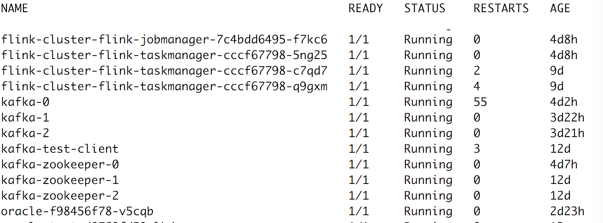

# Swordfish
Docs and Codes for Fitech Big Data Experiments

基于flink框架对oracle数据进行流式校验,通过Kafka Connect组件从oracle中读取数据到
Kafka中，然后用flink去消费kafka消息，并在flink中进行实时校验计算，并将数据归档到hdfs。


## 本地环境

### 运行环境配置
本地模式需要安装Kafka和zookeeper组件，运行在容器环境下，Flink是代码自己生成的LocalExecutionEnvironment
，不需要额外到安装配置。

必要到运行环境：
- maven
- jdk1.8
- docker

### 本地环境部署
通过工程目录下到docker-compose.yml，该文件已经配置好了相关容器，只需运行以下命令便会在后台启动所有组件。
```sbtshell
$ docker compose up -d 
```
本地模式下flink程序运行到说明待续。。。。。


## 集群环境
整个项目所有的需要的组件flink，kafka等都在kubernetes平台上部署(如下图所示)，所需要的配置文件在Swordfish/yamls目录下


其中flink集群包含一个jobmanager和3个taskmanager,kafka集群中包含了3个broker。

### 集群环境部署

#### flink集群部署
这里flink集群是通过helm（Kubernetes的一个包管理工具）部署的，所有需要在kubernetes平台安装预先安装helm工具。

flink部署命令，如下所示，在kelong这个namespace 下部署了有3个woker节点的flink集群。
```shell
$ cd yamls/flink 
$ helm install --name my-cluster --namespace kelong --set flink.num_taskmanagers=3 ./
```

我们可以通过`helm list`命令查看helm安装的flink集群信息，同时也可以通过`helm delete my-cluster --namespace kelong`
来删除整个集群

#### kafka集群部署
通过以下命令部署一个具有3个节点的Kafka集群和zookeeper集群环境
```shell
$ cd yamls/kafka
$ kubectl create -f kafka-zookeeper-svc.yml
$ kubectl craete -f kafka-zookeeper-svc-headless.yml  
$ kubectl craete -f kafka-zookeeper-statefulset.yml
$ kubectl craete -f kafka-svc.yml
$ kubectl craete -f kafka-svc-headless.yml
$ kubectl create -f kafka-statefulset.yml
```

#### Kafka Connect集群部署
我们需要通过Kafka Connect组件将oracle数据导入到Kafka集群中，需要配置一个Kafka Connect集群。我们在Kafka集群上继续搭建一个Kafka Connect集群，
需要修改[connect-distributed.properties](yamls/kafka-connector/connect-distributed.properties)配置文件中的bootstrap.servers以及group.id，
Kafka Connect通过这些配置来识别是否属于同一个集群；另外需要将[kafka-connect-jdbc-5.1.2.jar](yamls/kafka-connector/kafka-connect-jdbc-5.1.2.jar)
以及[ojdbc6-11.2.0.2.0.jar](yamls/kafka-connector/ojdbc6-11.2.0.2.0.jar)放在每个Kafka节点的`/usr/share/java/kafka`目录下，通过以下命令实现
```shell 
$ kubectl cp ojdbc6-11.2.0.2.0.jar your_pod_name:/usr/share/java/kafka -n kelong
$ kubectl cp kafka-connect-jdbc-5.1.2.jar your_pod_name:/usr/share/java/kafka -n kelong
```
最后在kafka容器内部启动Kafka Connect进程
```shell 
$ /usr/bin/connect-distributed  /etc/kafka/connect-distributed.properties
```
在三个Kafka节点中执行同样的操作，这样Kafka Connect集群就搭建完毕了，我们可以通过`curl`命令向集群提交任务
```shell
$ curl -X POST -H "Content-Type: application/json" http://10.244.7.46:8083/connectors --data 
'{
    "name": "test-oracle-jdbc-autoincrement", 
    "config": {"connector.class":"io.confluent.connect.jdbc.JdbcSourceConnector", 
    "tasks.max":"2",
    "poll.interval.ms":"10000000",
    "connection.url":"jdbc:oracle:thin:@NodeIP:NodePort:XE",
    "connection.user":"EAST_TEST", 
    "connection.password":"EAST_TEST", 
    "mode":"bulk", 
    "topic.prefix":"test", 
    "table.whitelist":"Table_Name" 
}'
```
这样Kafka Connect会将Oracle中的数据导入到Kafka中。

#### flink项目运行
使用maven进行打包，在项目所在目录通过`mvn clean package`进行打包，这会在target目录下生成一个jar包，已经包含了所需要到依赖包，
可以直接运行其中的类。

在flink集群中运行程序有两种方式，一种是通过flink的webui提交jar包运行，另外一种是在集群上使用通过命令行提交任务到flink集群，下面介绍到是第二中方式。
我们需要进入到flink集群内部，然后通过`/bin/flink run ` 提交任务

```shell 
$ kubectl exec -it your_flink_pod_name -n kelong /bin/bash
$ ./bin/flink run -c com.nju.StreamingJob /flink-test-1.0-SNAPSHOT.jar <topic> <path> <sourceParallelism> <sinkParallelism>
```
